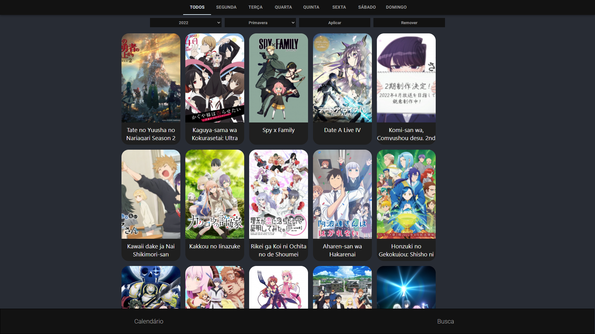
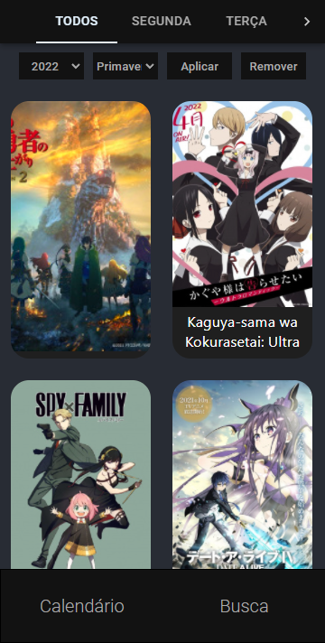
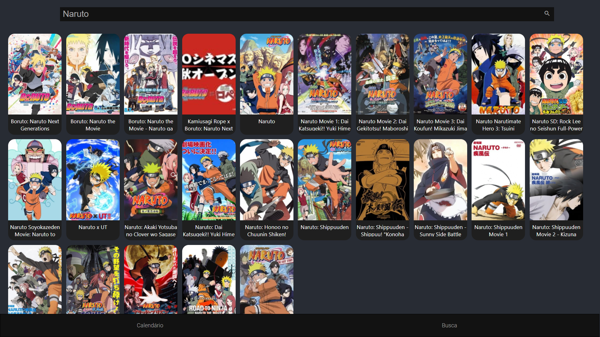
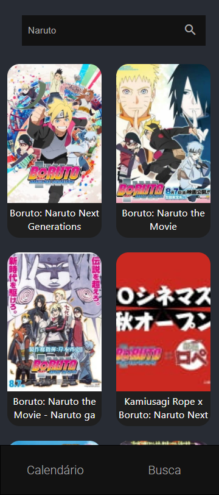
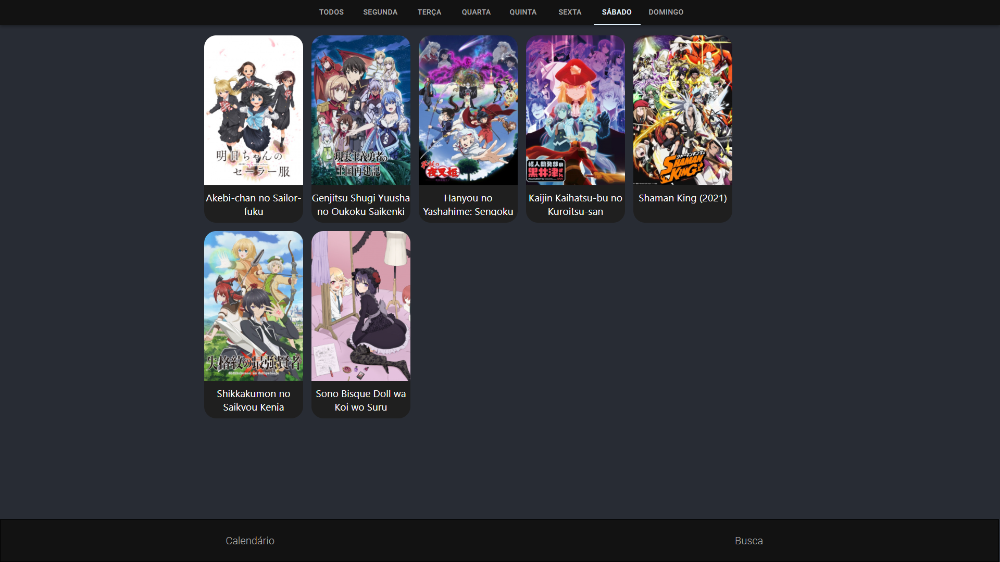
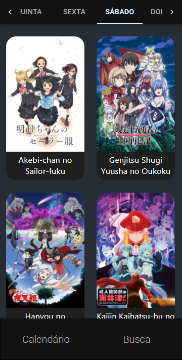

<div align="right">

[](README.md)

</div>
<p align="center"> 
  <a href="https://github.com/SidneyRoberto9">
    
  </a>  
     
  

## </p>

## **Visualizar**

<div align="center">

Deploy do front-end efetuado no [Vercel](https://vercel.com/) para visualizar: [Clique Aqui](https://animes-schedule-react.vercel.app/)

|                              :computer:Desktop                              |                              :iphone: Mobile                               |
| :-------------------------------------------------------------------------: | :------------------------------------------------------------------------: |
|  <kbd></kbd>  |  <kbd></kbd>  |
| <kbd></kbd> | <kbd></kbd> |
| <kbd></kbd> | <kbd></kbd> |

</div>
  
---
## _Sobre_

<div align="center">

Aplicação feita em React para visualizar os animes lançados da temporada atual, em cada dia da semana, consumindo uma api de um back-end proprio [`Animes Schendule Api`](https://github.com/SidneyRoberto9/animes-schedule-api).

---

</div>

</div>

## **Executar**

<div align="center">

Para executar esse projeto você precisa baixar este repositório, ter o Gerenciador de Pacotes do Node ([`NPM`](https://www.npmjs.com/get-npm)) ou o Gerenciador de Pacotes YARN ([`YARN`](https://yarnpkg.com/getting-started)) instalado.

Abra o prompt de comando no diretório do projeto na pasta <code>animes-schedule-react</code>, e execute os seguintes códigos:

<details>
  <summary><i>com <b>npm</b></i></summary>
  
  ```bash
  # Instalar dependências
  $ npm install ou npm i

# Iniciar o servidor de desenvolvimento

$ npm start

````

</details>

<details>
<summary><i>com <b>yarn</b></i></summary>

```bash
# Instalar dependências
$ yarn install

# Iniciar o servidor de desenvolvimento
$ yarn start

````

</details>

> ⚠️ O servidor de desenvolvimento será iniciado na porta: 3000 - Acesse <http://localhost:3000>

</div>

---

## _Tecnologias_

<div align="center">

|                      FrontEnd                       |
| :-------------------------------------------------: |
|         [React](https://pt-br.reactjs.org/)         |
|         [Mui Material](https://mui.com/pt/)         |
|  [Typescript 4.4](https://www.typescriptlang.org/)  |
|   [Axios](https://axios-http.com/ptbr/docs/intro)   |
| [Styled Components](https://styled-components.com/) |

</div>

---

## _Meus Contatos_

<div align="center">

[](https://www.linkedin.com/in/sidney-roberto-147076145/)
[](https://github.com/SidneyRoberto9)
[](mailto:sidneyrpsilva@gmail.com)

</div>

---

## _Licença_

<div align="center">

Copyright ©️ 2021 [ Sidney Roberto ](https://github.com/SidneyRoberto9).<br />
This project is licensed by [MIT](./LICENSE).

</div>
